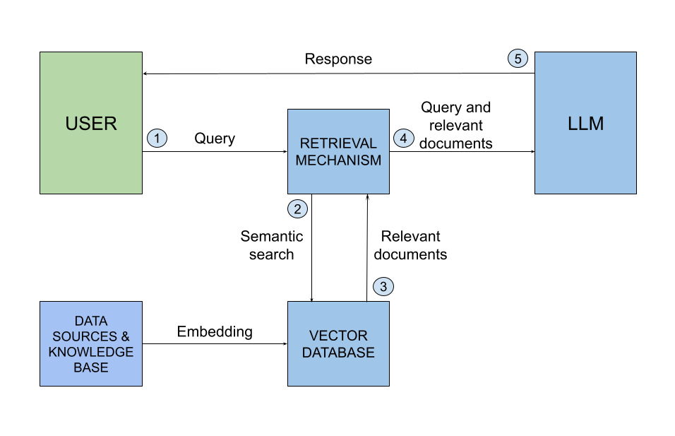

A **Retrieval-Augmented Generation (RAG)** application that lets you upload documents (.pdf, .txt, .md) and ask questions about their content. The system finds relevant passages and generates answers with source citations. 
This is currently a "Simple RAG" implementation, with plans to expand into more advanced techniques (e.g. GraphRAG, Agentic RAG) in the future.
## Architecture


*Source: [Merge.dev - How RAG works](https://www.merge.dev/blog/how-rag-works)*

## Tech Stack

| Component | Technology |
|-----------|-----------|
| Backend API | FastAPI (Python) |
| Vector DB | ChromaDB |
| LLM | OpenAI API / Ollama (local) |
| Embeddings | sentence-transformers (`all-MiniLM-L6-v2`) |
| PDF Parsing | pdfplumber |
| Frontend | Streamlit |
| Containerization | Docker + docker-compose |

## Quick Start

### 1. Setup

```bash
# Clone and enter the project
cd rag-app

# Create virtual environment
python -m venv venv
source venv/bin/activate  # Linux/Mac
# venv\Scripts\activate   # Windows

# Install dependencies
pip install -r requirements.txt

# Copy and configure environment
cp .env.example .env
# Edit .env with your settings
```

### 2. Choose your LLM

**Option A: Ollama (free, local)**
```bash
# Install Ollama: https://ollama.ai
ollama pull llama3.2    # ~2GB download
# .env: LLM_PROVIDER=ollama
```

**Option B: OpenAI (paid, cloud)**
```bash
# .env: LLM_PROVIDER=openai
# .env: OPENAI_API_KEY=sk-your-key-here
```

### 3. Run

```bash
# Start the API backend
uvicorn src.main:app --reload --port 8000

# In another terminal — start the frontend
streamlit run frontend/app.py
```

Open http://localhost:8501 in your browser.

### 4. Docker (alternative)

```bash
docker-compose up --build
```

## API Endpoints

| Method | Endpoint | Description |
|--------|----------|-------------|
| `POST` | `/documents/upload` | Upload & index a PDF/TXT |
| `GET`  | `/documents/` | List indexed documents |
| `GET`  | `/documents/{id}/info` | Get specific document stats |
| `DELETE`| `/documents/{id}` | Delete document + vectors |
| `POST` | `/query/ask` | Full RAG pipeline with Chat History |
| `POST` | `/query/search` | Retrieval only (no LLM) |
| `GET`  | `/chats` | List all saved chat sessions |
| `GET`  | `/chats/{chat_id}` | Get full history of a chat session |
| `DELETE`| `/chats/{chat_id}` | Delete a chat session |
| `GET`  | `/health` | Health check |

API docs available at: http://localhost:8000/docs

## Testing

```bash
pytest tests/ -v
```
