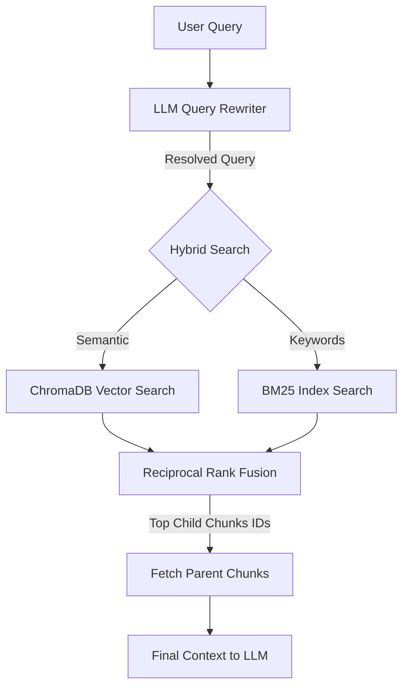

An **Advanced RAG** application that lets you upload documents (.pdf, .txt, .md) and ask questions about their content. The system finds relevant passages and generates answers with source citations. 
It utilizes Hybrid Search (Vector + BM25 keyword matching) and Small-to-Big Retrieval (Parent-Child chunking) with Reciprocal Rank Fusion (RRF) to merge the results. It also features conversation memory, query rewriting, and Server-Sent Events (SSE) streaming.

## Architecture


*Source: [Merge.dev - How RAG works](https://www.merge.dev/blog/how-rag-works)*

### Retrieval Flow



## Tech Stack

| Component | Technology |
|-----------|-----------|
| Backend API | FastAPI (Python) |
| Vector DB | ChromaDB |
| Keyword Index | rank-bm25 |
| LLM | OpenAI API / Ollama (local) |
| Embeddings | sentence-transformers (`all-MiniLM-L6-v2`) |
| Parsing | pdfplumber, bs4, markdown |
| Frontend | Streamlit |
| Containerization | Docker |

## Quick Start

### 1. Setup

```bash
# Clone and enter the project
cd rag-app

# Create virtual environment
python -m venv venv
source venv/bin/activate  # Linux/Mac
# venv\Scripts\activate   # Windows

# Install dependencies
pip install -r requirements.txt

# Copy and configure environment
cp .env.example .env

# Edit .env with your settings (Requires an access code for UI)
# APP_PASSWORD=your_secure_password
```

### 2. Choose your LLM

**Option A: Ollama (free, local)**
```bash
# Install Ollama: https://ollama.ai
ollama pull llama3.2    # ~2GB download
# .env: LLM_PROVIDER=ollama
```

**Option B: OpenAI (paid, cloud)**
```bash
# .env: LLM_PROVIDER=openai
# .env: OPENAI_API_KEY=sk-your-key-here
```

### 3. Run

```bash
# Start the API backend
uvicorn src.main:app --reload --port 8000

# In another terminal — start the frontend
streamlit run frontend/app.py
```

Open http://localhost:8501 in your browser.

### 4. Docker (alternative)

**Prerequisite for Linux users running local Ollama:**  
By default, a local Ollama service only listens to `localhost` (127.0.0.1) which blocks Docker containers. You must instruct it to listen on all interfaces.

Run it manually via terminal:
```bash
OLLAMA_HOST="0.0.0.0" ollama serve
```
*(Or if it runs as a systemd service, edit it via `sudo systemctl edit ollama` and add `[Service]` -> `Environment="OLLAMA_HOST=0.0.0.0"`).*

Start the application:
```bash
docker-compose up --build
```

To stop the application and clean up containers/volumes entirely:
```bash
docker-compose down -v
```

## API Endpoints

| Method | Endpoint | Description |
|--------|----------|-------------|
| `POST` | `/documents/upload` | Upload & index a PDF/TXT/MD |
| `GET`  | `/documents/` | List indexed documents |
| `GET`  | `/documents/{id}/info` | Get specific document stats |
| `DELETE`| `/documents/{id}` | Delete document + vectors |
| `POST` | `/query/ask` | Full RAG pipeline with Chat History |
| `POST` | `/query/ask/stream` | Full RAG pipeline with SSE stream |
| `POST` | `/query/search` | Retrieval only (no LLM) |
| `GET`  | `/chats` | List all saved chat sessions |
| `GET`  | `/chats/{chat_id}` | Get full history of a chat session |
| `DELETE`| `/chats/{chat_id}` | Delete a chat session |
| `GET`  | `/health` | Health check |

API docs available locally at: http://localhost:8000/docs (disabled in production networking).

## Security & Authentication

The Streamlit UI is protected by an environment-based access code. 
- You must set `APP_PASSWORD` in your `.env` file.
- If the variable is missing, the application defaults to a "Fail-Secure" state and locks all visitors out.
- The `fastapi` backend is completely isolated by Docker's internal network (`ports` removed in production) and cannot be accessed externally. 

## Deployment (CI/CD)

The application is deployed to a remote Linux VPS (Ubuntu) using **Docker Compose**.
Continuous Deployment is automated via **GitHub Actions** (`.github/workflows/deploy.yml`).

When a PR is merged or code is pushed to the `main` branch:
1. The **CI pipeline** runs `ruff` for linting and `pytest` for unit testing.
2. If tests pass, the **CD pipeline** connects to the server via SSH.
3. It performs a `git pull`, rebuilds the Docker images, and restarts the containers automatically with zero downtime.

## Testing

```bash
pytest tests/ -v
```
